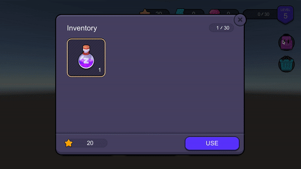

# Product
## DEMO  [[Youtube]](https://www.youtube.com/watch?v=JIzXEaq_nv8&ab_channel=ZEPETO)

> This is a sample implementation of the [[Zepeto Product API]](https://naverz-group.readme.io/studio-world/docs/zepeto_product_api)

## Dependency
- Zepeto World 1.12.2 or higher
- Zepeto Product 1.0.0-preview or higher

## Easy Start Guide
- Bring the ProductCanvas located in Assets/ProductSystem/Prefab into your scene.
- Follow the [[Zepeto Product Guide]](https://naverz-group.readme.io/studio-world/docs/zepeto_product) to register products and currencies in your studio.
- Enter your World ID in the Open World Setting.

## Project Configuration
#### Assets/ProductSystem/Script
- UIBalance.ts (This script displays the user's currency at the top of the screen.)
  - RefreshBalanceUI() Updates the user's currency UI.
  - RefreshOfficialCurrencyUI() Updates the official currency (gems) UI.
  - IncreaseExp(quintity) Increases the user's experience points.
  - RefreshExpUI() Updates the experience points UI.
  - LevelUpReward() Rewards the user with a level-up reward (star5)
- UIInventory.ts (This script displays the inventory.)
  - LoadAllItems() Loads and caches all items.
  - RefreshInventoryUI() Updates the inventory UI.
  - UpdateInventory() Changes the quantity of inventory items. (When the quantity changes)
  - CreateInventory() Recreates the inventory items. (When the contents change)
  - RefreshBalanceUI() Updates the user's currency UI.
  - OnClickUseInventoryItem() Uses the clicked inventory item.
- UIShop.ts (This script displays the shop.)
  - RefreshZemUI() Updates the official currency (gems) UI.
  - RefreshProducts() Updates the shop items.
- UICommonBtn.ts (This is the main code for the test buttons and affects the increase/decrease of data.)
  - LoadAllItems() Loads and caches all items.
  - OpenInformation(message) Displays information in a popup window.
  - OnClickGainBalance(currencyId, quantity) Gains currency.
  - OnClickUseBalance(currencyId, quantity) Uses currency.
  - OnClickIncreaseExp() Increases experience points.
  - OnClickAcquiringRandomItem() Gains a random item from the cached items.
  - OnClickPurchaseItemImmediately() Immediately purchases a specific item.
  - OnClickPurchaseItem(productId) Attempts to purchase a specific item using the official UI.

